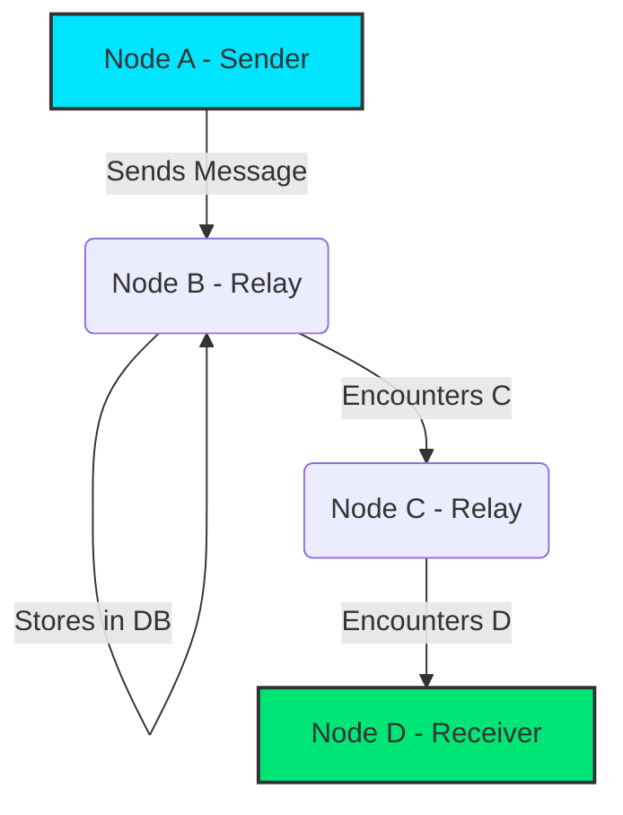

# Indian Mesh 🚀

**Indian Mesh** is a production-grade, offline-first peer-to-peer messaging application for Android. It operates completely independent of the internet, leveraging Bluetooth Low Energy (BLE) and Wi-Fi Direct to form dynamic mesh networks between physical devices.

Built entirely from scratch, this architecture is heavily inspired by modern decentralized systems, adopting a strict **11-module Clean Architecture** approach, ensuring absolute separation of concerns.

## 🏗️ Architecture Overview

The codebase is divided into granular Gradle modules to strictly enforce dependency boundaries.

- `app` - Dependency Injection (Dagger/Hilt), Background Services, and the Jetpack Compose UI.
- `core` - Cryptographic primitives, domain models, and system utilities.
- `domain` - Pure logic use cases, and abstract repository interfaces.
- `database` - Local persistence utilizing Room, fully encrypted at rest with SQLCipher.
- `crypto` - Military-grade End-to-End Encryption (E2EE) utilizing Android Keystore, AES-GCM-256 for payloads, and ECDH for key exchange.
- `network` - The transport layer handling BLE Advertising/Discovery, Wi-Fi Direct socket connections, and MTU payload chunking.
- `routing` - The intelligence of the mesh. Implements the **Epidemic Routing Protocol** and **Bloom Filter Sync**.

## 📡 The Epidemic Routing Protocol

Indian Mesh implements an Epidemic Routing mechanism to propagate messages across the network even when the sender and receiver are not directly connected.

When two nodes connect, they perform a **Bloom Filter Sync** to rapidly deterministically reconcile which messages each node has seen, drastically reducing network overhead.

## 🔒 Security Model
- **Encryption at Rest**: The local Room database is encrypted using SQLCipher.
- **Encryption in Transit**: All payloads sent over BLE or Wi-Fi Direct are encrypted using `AES-GCM` with keys derived via `ECDH` (Elliptic Curve Diffie-Hellman).
- **Non-Repudiation**: Every message is signed using an `ECDSA` digital signature to prevent tampering by intermediary relay nodes.

## 🛠️ Getting Started

### Prerequisites
- Android Studio Ladybug or newer.
- Android SDK 35.
- Minimum SDK 26 (Android 8.0).

### Build Instructions
1. Clone the repository.
2. Open the project in Android Studio.
3. Allow Gradle to sync.
4. Run the `app` module on a physical device.

*(Note: Emulators do not support BLE or Wi-Fi Direct efficiently. True mesh testing requires at least 2, ideally 3+, physical Android devices.)*

## 🤝 Contributing
Contributions are welcome! Please submit a Pull Request. Ensure your code passes all lint checks and compiles via the configured GitHub Actions pipeline.

## 📄 License
Copyright (c) 2026 Indian Mesh. All rights reserved.
